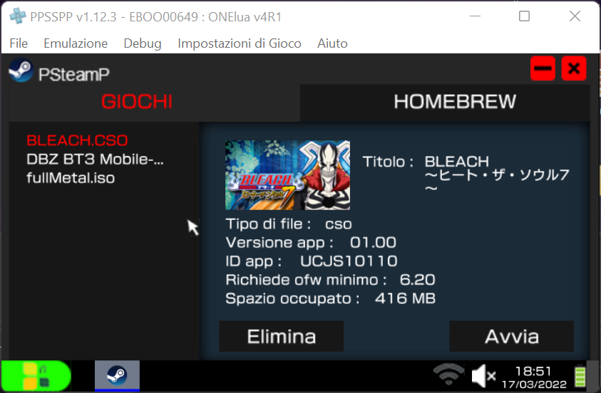
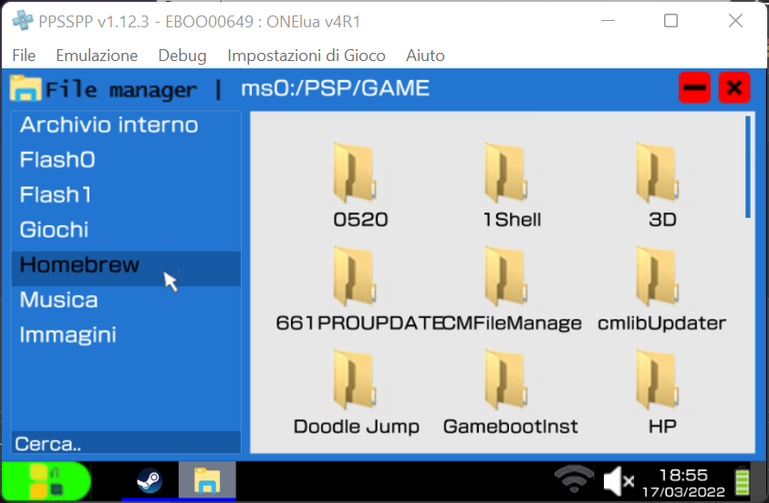

<h1>NinOS</h1>
NinOS is a PSP gui written in lua that uses the OneLua4R1 interpreter. Some functions may not work properly.
   
Insert NinOS directory in PSP/GAME and run it :)
   
   
<h1>Some screen :) </h1>
</img>
</img>
